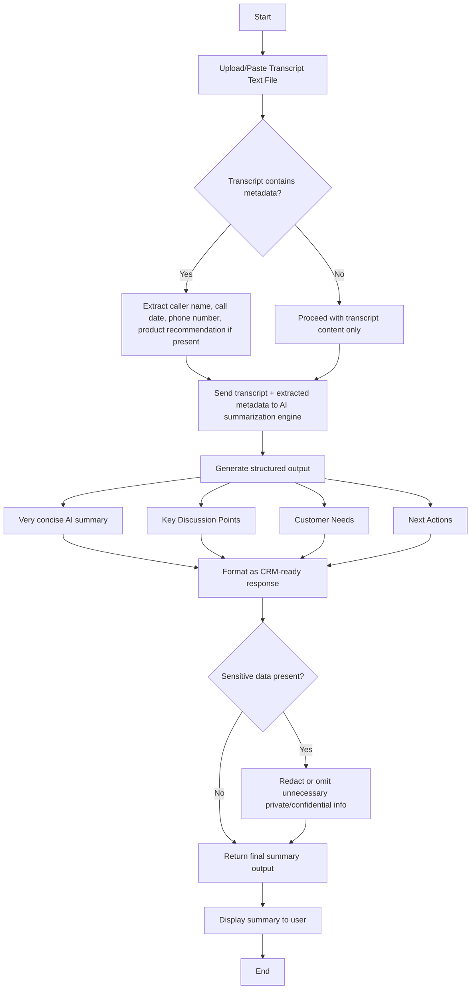

# Sales Call Summary Generator

This repository contains a React + Vite frontend and a FastAPI backend for generating structured sales call summaries from transcript text.

## Project structure

- `frontend/` — React/Vite application for transcript entry and summary display
- `backend/` — FastAPI service that accepts transcript input and returns structured summary data
- `resources/` — supporting documentation, including user flow, checklist, and UI tone guidance

## User flow

Users paste or upload a call transcript, then the frontend sends it to the backend. The backend processes the text, applies AI summarization, and returns:

- a concise summary
- key discussion points
- customer needs
- next actions



For the full flow document, see `resources/sales_call_summary_flow.md`.

## Getting started

### Frontend

```bash
cd frontend
npm install
npm run dev
```

Open the Vite URL, usually `http://localhost:5173`.

### Backend

```bash
cd backend
python3 -m venv .venv
source .venv/bin/activate
pip install -r requirements.txt
uvicorn app.main:app --reload --host 0.0.0.0 --port 8000
```

## API

### Endpoint

- `POST /transcripts/summarize`
- `GET /health`

### Request body

```json
{
  "transcript": "Sales call transcript text..."
}
```

### Response fields

- `summary`
- `key_points`
- `customer_needs`
- `action_items`
- `sentiment`
- `follow_up_needed`
- `caller_name`
- `phone_number`
- `call_date`

## Notes

- The frontend sends transcript text to the backend; it does not call the AI provider directly.
- Store API keys and provider credentials in the backend environment.
- Use `VITE_API_URL` in `frontend/.env` to point the frontend to a deployed backend.
- See `resources/sales_call_summary_ui_tone.md` for UI tone and copy guidance.
