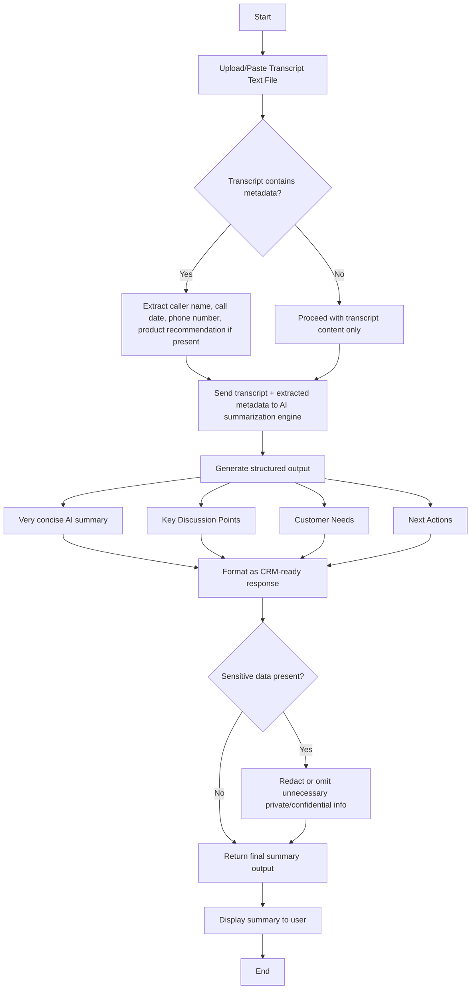

# Use Case 2: Sales Call Summary Generator Flow

## Process Flow

## Description

1. **Input**
   - User provides only the transcript text file.
   - The system reads the transcript and detects any caller metadata embedded in the text.

2. **Metadata extraction**
   - If the transcript includes caller name, date, phone number, or product recommendation, these are extracted.
   - If metadata is missing, the app still proceeds using only the transcript.

3. **AI summarization**
   - The AI engine receives the transcript plus any extracted metadata.
   - The AI creates a very concise summary and populates three structured sections:
     - Key Discussion Points
     - Customer Needs
     - Next Actions

4. **Security filter**
   - The system removes or redacts unnecessary private/confidential details before returning output.
   - Raw transcript text is never returned as part of the summary.

5. **Output**
   - The final output is CRM-ready and concise.
   - The user sees a summary that includes extracted metadata only if it was present in the transcript.

   ## Problem Statement

   - Context: Sales reps spend significant time writing inconsistent call notes after customer calls.
   - Problem: Notes are time-consuming, vary in quality, and often miss actionable follow-ups, harming CRM data and deal velocity.
   - Impact: Reduced rep productivity, missed follow-ups, inaccurate pipeline data, and lower win rates.

   ## File Summary

   - File: `resources/sales_call_summary_flow.md`
   - Purpose: Defines the end-to-end process for converting a call transcript into a CRM-ready summary while protecting sensitive data.
   - Key steps:
      - Input: paste or upload transcript (text file).
      - Metadata extraction: detect and extract caller name, date, phone number, product recommendation when present.
      - AI summarization: produce a very concise summary plus structured sections (Key Discussion Points, Customer Needs, Next Actions).
      - Security filter: redact or omit sensitive information; never return raw transcript text.
      - Output: return CRM-ready structured JSON and display a concise visual summary to the user.

   Use this file as the implementation reference for developers, testers, and security reviewers.
