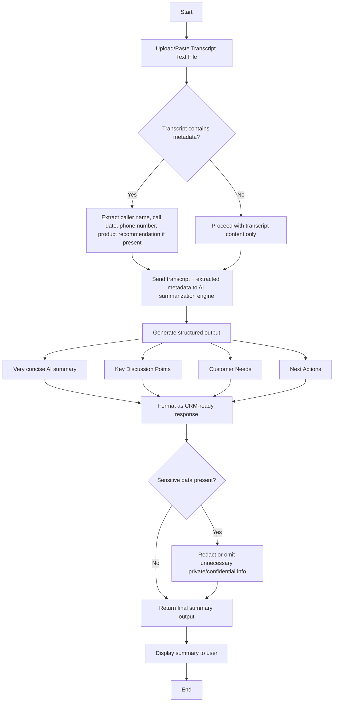

# Use Case 2: Sales Call Summary Generator Flow

## Process Flow

## Description

1. **Input**
   - User provides only the transcript text file.
   - The system reads the transcript and detects any caller metadata embedded in the text.

2. **Metadata extraction**
   - If the transcript includes caller name, date, phone number, or product recommendation, these are extracted.
   - If metadata is missing, the app still proceeds using only the transcript.

3. **AI summarization**
   - The AI engine receives the transcript plus any extracted metadata.
   - The AI creates a very concise summary and populates three structured sections:
     - Key Discussion Points
     - Customer Needs
     - Next Actions

4. **Security filter**
   - The system removes or redacts unnecessary private/confidential details before returning output.
   - Raw transcript text is never returned as part of the summary.

5. **Output**
   - The final output is CRM-ready and concise.
   - The user sees a summary that includes extracted metadata only if it was present in the transcript.
